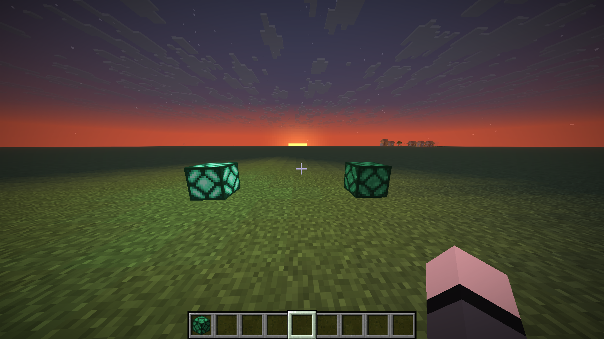

# Starlight

コンテンツ追加系はクライアント用コードもアセット生成コードも全部一箇所にまとめて書きたい！！！！！！

<br>っていう人(=我)のためのFabric Mod 用の API

## Usage

### セットアップ

> [!WARNING]
> - `fabric.mod.json` に `TestMod`, `TestModClient`, `TestModDataGenerator` について記述すること
> - Starlight は MOD であり、 `mods` フォルダに配置する必要があります

```kotlin
class TestMod : StarlightModInitializer() {
    override val identifier = "testmod"

    override fun onInitialize() {}
}

class TestModClient : StarlightClient(TestMod)

class TestModDataGenerator : StarlightDataGenerator(TestMod)
```

### Register New Block

#### Prismarine Lamp を登録する例

> [!WARNING]
> - assets/MOD_ID/textures/block/に対応する画像ファイルを配置すること
> (↓の例の場合, `block/prismarine_lamp.png`, `block/prismarine_lamp_on.png` が必要)

```kotlin
class TestMod : StarlightModInitializer() {
    override val identifier = "testmod"

    override fun onInitialize() {
        val prismarineLamp = blockRegistry.register("prismarine_lamp") {
            val info = customBehaviour {
                blockStates {
                    booleanProperty("luminance") {
                        defaultValue = false
                    }
                }

                events {
                    onInteract {
                        val property = props.boolean("luminance")
                        val value = blockState.getValue(property)
                        level.setBlockAndUpdate(blockPos, blockState.setValue(property, !value))
                    }
                }
            }

            blockProperties {
                destroyTime = 0.5f
                sound = SoundType.METAL
                requiresCorrectToolForDrops = true
                lightLevel {
                    if (it.getValue(info.properties.boolean("luminance"))) 15 else 0
                }
            }

            itemProperties {
                translationKeyAuto()
            }

            translation {
                jaJp = "プリズマリンランプ"
                enUs = "Prismarine Lamp"
            }

            rendering {
                blockModel {
                    val unlit = models.cubeAll(defaultTexturePath)
                    val lit = models.cubeAll(defaultTexturePath.suffixed("on")) {
                        suffix = "on"
                    }

                    variants(info.properties.boolean("luminance")) {
                        unlit.toVariant().useWhen(false)
                        lit.toVariant().useWhen(true)
                    }

                    unlit.setAsItemModel()
                }

                chunkSectionLayer {
                    solid()
                }
            }
        }
    }
}
```

うまくいくと:


### Register New Translation
> [!NOTE]
> これを使用せずとも、ブロック等の翻訳名は定義可能

```kotlin
class TestMod : StarlightModInitializer() {
    override val identifier = "testmod"

    override fun onInitialize() {
        translationRegistry.register("foo.testmod.test_message") {
            enUs = "Test Message"
            jaJp = "テストメッセージ"
        }
    }
}
```

### 他の機能

まだ

#### 実装予定
- アイテム追加
- エンティティ追加

など
